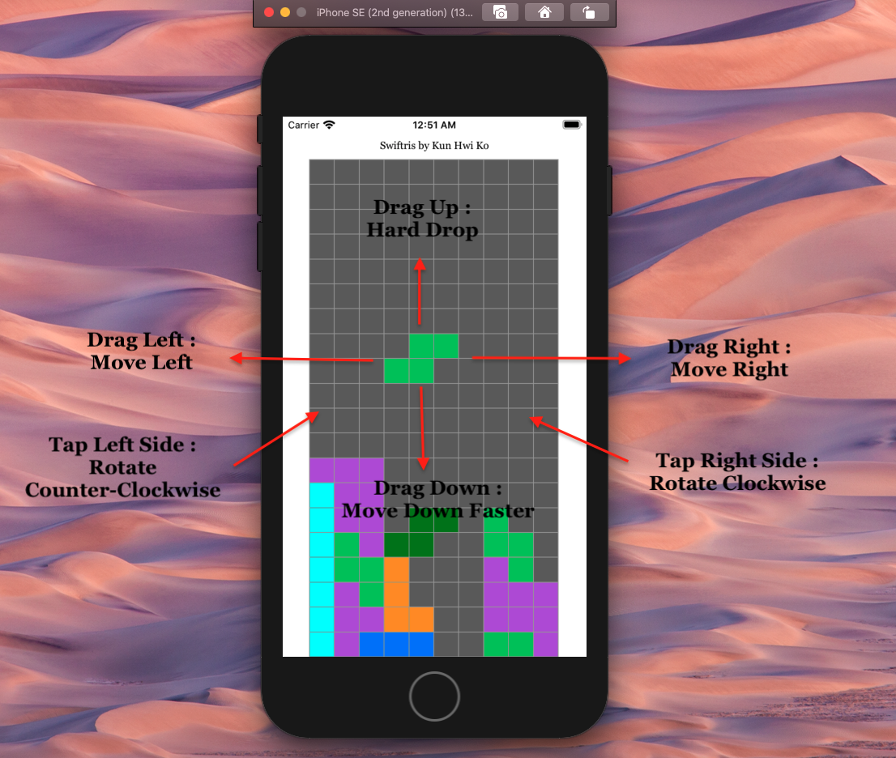

# Tetris
### Description
-----
Welcome to Swiftris (Tetris written in Swift)! This game has many familiar features such as :

* 20x10 Tetris board and 7 differently colored Tetrominos

* Line is cleared from the board once an entire row is filled 

* Yes, there are wall kicks!

* Additional features such as scores, levels, floor kicks, T-spins, and most importantly, music may be implemented in the future 

### Rules 
-----

### Compile / Run
-----
The simplest way to run Swift programs on MacOS is to download XCode. Make sure your OS is up to date before downloading the program.

### Files
-----
* ColorUI.swift 
  * Holds custom colors of the board and the different Tetrominos 
  
* GamePieces.swift 
  * File with structures and classes that define Tetromino properties  
  
* GameUI.swift 
  * This file instantiates the board, and is the heart of the Tetris game
  * Makes pieces falling down, left/right movements, and rotations possible. 

* Viewer.swift / ContentView.swift 
  * Defines the layout on an iOS device screen
  
### References
-----
I referenced additional details such as Tetromino names, shadow colors, or wall kicks using https://tetris.fandom.com/wiki/Tetris_Wiki. If you are not familiar with Tetris, feel free to read up the instructions from this page. 

I would also like to add that I have referenced https://www.youtube.com/channel/UCsgr7nAvsNLvUybqIJp3ySA to learn more about building Swiftris. I definitely recommend the channel for programmers who are new to Swift.
  
